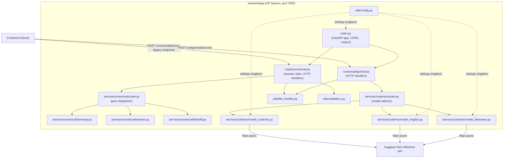

# Design Document

## Backend Refactor & Integration — AI Data Cleaning Copilot (ERROR-PROOF Edition)

---

## Overview

The goal of this refactor is to unify two independent backend modules — a monolithic numerical data-cleaning engine (`backend/main.py` + helpers) and a standalone NLP codemix engine (`backend/for codemix/`) — into a single, layered FastAPI application deployed to Hugging Face Spaces.

No core ML logic is rewritten. Every algorithm (IsolationForest, PCA, FlashFill transformations, codemix model dispatch) is preserved verbatim; only the file layout, import paths, and shared infrastructure change.

The unified app exposes two top-level route groups:
- `/numerical` — CSV-based data cleaning (profiling, missing values, FlashFill, anomaly detection, rename, export)
- `/categorical` — NLP analysis of CSV text columns via Hugging Face Inference API

A Vercel-hosted React frontend communicates with the backend over HTTP. CORS is open (`*`) to support the Vercel deployment without configuration overhead.

---

## Architecture



### Key Architectural Decisions

1. **Session state stays in the route layer.** The in-memory `current_state` dict (DataFrame + col_types + filename) lives in `routes/numerical.py`, mirroring the existing `main.py` pattern. This keeps the service layer stateless and testable.

2. **Numerical router is a pure dispatcher.** `services/numerical/router.py` contains no state and no HTTP concerns — it maps an `operation` string to a function call and returns the raw result. The route handler owns error-to-HTTP translation.

3. **Codemix router wraps the existing `_dispatch` heuristic.** The model-selection logic from `routes/predict.py` is extracted into `services/codemix/router.py` unchanged. The categorical route handler calls it and translates exceptions to HTTP responses.

4. **Config is a pydantic-settings singleton.** `utils/config.py` uses `lru_cache` so `.env` is parsed exactly once. New variable names (`HF_CODEMIX_URL`, `HF_ENGLISH_URL`, `HF_FAKE_NEWS_URL`, `HF_CODEMIX_TOKEN`, `HF_ENGLISH_TOKEN`, `HF_FAKE_NEWS_TOKEN`) replace the generic `hf_model_N_url` / `hf_token_N` names.

5. **File handling is centralised.** `utils/file_handler.py` owns all CSV parsing concerns: encoding detection (UTF-8 → latin-1 fallback), size enforcement (200 MB), empty-file detection, and column deduplication.

6. **Validation is centralised.** `utils/validators.py` owns type-compatibility checks so the same rules apply whether the call comes from `/numerical/process` or a legacy fine-grained endpoint.

7. **Uniform response envelope.** Every route returns `{ status, module, model_used, result }` on success and `{ status, detail }` on error, enabling uniform frontend error handling.

---

## Components and Interfaces

### `app/main.py`

```python
app = FastAPI(title="AI Data Cleaning Copilot")
app.add_middleware(CORSMiddleware, allow_origins=["*"], ...)
app.include_router(numerical_router, prefix="/numerical")
app.include_router(categorical_router, prefix="/categorical")

@app.get("/")   -> { status: "ok", message: str }
@app.get("/health") -> { env: str, models: { codemix: bool, english: bool, fakenews: bool } }
```

On startup, logs `app_env` and `log_level` at INFO.

---

### `app/routes/numerical.py`

Owns `current_state` (module-level dict). Exposes:

| Endpoint | Method | Description |
|---|---|---|
| `/numerical/process` | POST | Unified entry point — delegates to `numerical_router.dispatch()` |
| `/upload` | POST | Upload CSV, populate session state |
| `/profile` | GET | Return profile of loaded DataFrame |
| `/duplicates` | GET | Return duplicate rows |
| `/remove_duplicates` | POST | Remove duplicates in-place |
| `/missing_strategy` | POST | Apply missing-value strategy |
| `/flashfill/suggest` | POST | Get FlashFill suggestions |
| `/flashfill/apply` | POST | Apply FlashFill transformation |
| `/anomalies/detect` | POST | Run IsolationForest |
| `/anomalies/action` | POST | Remove or flag anomalies |
| `/rename/suggest` | GET | Get rename suggestions |
| `/rename/apply` | POST | Apply rename map |
| `/export/data` | GET | Export cleaned CSV |
| `/override_type` | POST | Override detected column type |

All handlers follow the pattern:
```python
try:
    result = ...
    return { "status": "success", "module": "numerical", "model_used": None, "result": result }
except ValueError as e:
    raise HTTPException(400, detail=str(e))
except Exception as e:
    logger.error(traceback.format_exc())
    raise HTTPException(500, detail="Internal server error")
```

---

### `app/routes/categorical.py`

Stateless. Exposes:

| Endpoint | Method | Description |
|---|---|---|
| `/categorical/process` | POST | Upload CSV, route to HF model, return result |

```python
try:
    df = file_handler.parse(file)
    model_name, result = await codemix_router.route(df)
    return { "status": "success", "module": "categorical", "model_used": model_name, "result": result }
except httpx.HTTPStatusError as e:
    raise HTTPException(502, detail=f"Hugging Face API error ({e.response.status_code}): {e.response.text}")
except RuntimeError as e:
    raise HTTPException(503, detail=str(e))
except ValueError as e:
    raise HTTPException(400, detail=str(e))
```

---

### `app/services/numerical/router.py`

Pure function — no state, no HTTP.

```python
async def dispatch(operation: str, df: pd.DataFrame, **kwargs) -> Any:
    if operation == "profile":    return generate_profile(df, detect_column_types(df))
    if operation == "duplicates": return _get_duplicates(df)
    if operation == "missing":    return apply_missing_strategy(df, **kwargs)
    if operation == "flashfill":  return _flashfill(df, **kwargs)
    if operation == "anomaly":    return detect_anomalies(df, **kwargs)
    if operation == "rename":     return _rename(df, **kwargs)
    raise ValueError(f"Unknown operation: {operation}")
```

---

### `app/services/codemix/router.py`

Adapted from `routes/predict.py`. Extracts the `_dispatch` heuristic:

```python
async def route(df: pd.DataFrame) -> tuple[str, Any]:
    """Analyse df text content, select model, call service, return (model_name, result)."""
    text = _extract_text(df)
    model_name = _select_model(text)   # preserved heuristic from predict.py
    result = await _call_service(model_name, text)
    return model_name, result
```

---

### `app/services/codemix/model_codemix.py` / `model_english.py` / `model_fakenews.py`

Direct adaptations of `model1.py`, `model2.py`, `model3.py`. Only changes:
- Import path: `from app.utils.config import settings`
- Config field names: `settings.hf_codemix_url` / `settings.hf_codemix_token` etc.
- Timeout messages use model-specific names: `"CodeMix request timed out. Please try again."`

Interface (identical across all three):
```python
async def model_codemix_service(payload: dict) -> dict:
    # returns {"result": <raw HF response>}
    # raises RuntimeError on timeout/connection error
    # raises httpx.HTTPStatusError on 4xx/5xx
```

---

### `app/utils/config.py`

```python
class Settings(BaseSettings):
    hf_codemix_url:    str
    hf_english_url:    str
    hf_fake_news_url:  str
    hf_codemix_token:  str
    hf_english_token:  str
    hf_fake_news_token: str
    app_env:   str = "development"
    log_level: str = "INFO"
    model_config = SettingsConfigDict(env_file=".env", case_sensitive=False)

@lru_cache()
def get_settings() -> Settings: ...

settings = get_settings()
```

---

### `app/utils/file_handler.py`

```python
def parse_csv(file_bytes: bytes) -> pd.DataFrame:
    """
    1. Reject if len(file_bytes) == 0            → ValueError("Uploaded file is empty")
    2. Reject if len(file_bytes) > 200*1024*1024 → ValueError("File exceeds 200 MB limit")
    3. Try pd.read_csv(UTF-8); on UnicodeDecodeError retry with latin-1
    4. Reject if df is empty (0 rows)            → ValueError("Uploaded file is empty")
    5. Deduplicate column names with numeric suffix
    6. Return df
    """
```

---

### `app/utils/validators.py`

```python
NUMERIC_ONLY_STRATEGIES = {"mean", "median", "interpolate"}
KNOWN_OPERATIONS = {"profile", "duplicates", "missing", "flashfill", "anomaly", "rename", "export"}

def validate_missing_strategy(col_type: str, strategy: str) -> Optional[str]:
    """Returns None if valid, or an error message string."""
    if strategy == "mean" or strategy == "median":
        if col_type not in ("numeric",):
            return "Type Error: Cannot apply Mean/Median to categorical data"
    if strategy == "interpolate":
        if col_type not in ("numeric",):
            return "Type Error: Cannot apply Interpolate to non-numeric data"
    return None

def validate_operation(operation: str) -> Optional[str]:
    if operation not in KNOWN_OPERATIONS:
        return f"Unknown operation: {operation}"
    return None
```

---

## Data Models

### Session State (in-memory, per-process)

```python
current_state: dict = {
    "df":        Optional[pd.DataFrame],   # currently loaded DataFrame
    "col_types": Optional[dict],           # output of detect_column_types(df)
    "filename":  Optional[str],            # original upload filename
}
```

### Response Envelope

```python
# Success
{
    "status":     "success",
    "module":     "numerical" | "categorical",
    "model_used": str | None,   # None for numerical; model name for categorical
    "result":     Any           # operation-specific payload
}

# Error
{
    "status": "error",
    "detail": str
}
```

### Config Environment Variables

| Variable | Description |
|---|---|
| `HF_CODEMIX_URL` | HF Inference API URL for CodeMix model |
| `HF_ENGLISH_URL` | HF Inference API URL for English model |
| `HF_FAKE_NEWS_URL` | HF Inference API URL for FakeNews model |
| `HF_CODEMIX_TOKEN` | Bearer token for CodeMix model |
| `HF_ENGLISH_TOKEN` | Bearer token for English model |
| `HF_FAKE_NEWS_TOKEN` | Bearer token for FakeNews model |
| `APP_ENV` | Deployment environment (default: `"development"`) |
| `LOG_LEVEL` | Python logging level (default: `"INFO"`) |

### Pydantic Request Models (numerical route)

```python
class ProcessRequest(BaseModel):
    operation: str
    column:       Optional[str]
    strategy:     Optional[str]
    value:        Optional[str]
    transform_id: Optional[str]
    contamination: Optional[float] = 0.05
    renames:      Optional[Dict[str, str]]
```

---

## Correctness Properties

*A property is a characteristic or behavior that should hold true across all valid executions of a system — essentially, a formal statement about what the system should do. Properties serve as the bridge between human-readable specifications and machine-verifiable correctness guarantees.*

### Property 1: Migration Equivalence

*For any* valid pandas DataFrame and any set of parameters, calling a migrated service function (anomaly, cleaner, flashfill) should produce output that is structurally identical to calling the original function with the same arguments.

**Validates: Requirements 1.5, 1.6**

---

### Property 2: Config Round Trip

*For any* environment dict containing all six required HF variable keys with non-empty string values, constructing a `Settings` instance should expose each value under its corresponding field name without mutation.

**Validates: Requirements 2.1**

---

### Property 3: Config Singleton Idempotence

*For any* number of calls to `get_settings()` within the same process, all calls should return the exact same object (identity equality), confirming the `lru_cache` parses `.env` exactly once.

**Validates: Requirements 2.2**

---

### Property 4: Config Rejects Missing Variables

*For any* subset of the six required HF environment variables that is missing from the environment, instantiating `Settings` should raise a `pydantic.ValidationError` that names the missing field.

**Validates: Requirements 2.3**

---

### Property 5: File Handler Encoding Fallback

*For any* byte sequence that is valid latin-1 but not valid UTF-8 and represents a well-formed CSV, `parse_csv` should successfully return a non-empty DataFrame rather than raising an exception.

**Validates: Requirements 3.1, 3.2**

---

### Property 6: File Handler Rejects Invalid CSV

*For any* byte sequence that cannot be parsed as a CSV by pandas (after both UTF-8 and latin-1 attempts), `parse_csv` should raise a `ValueError`.

**Validates: Requirements 3.4**

---

### Property 7: Column Deduplication Uniqueness

*For any* CSV bytes whose parsed DataFrame contains duplicate column names, after `parse_csv` returns, all column names in the resulting DataFrame should be unique strings.

**Validates: Requirements 3.5**

---

### Property 8: Validator Rejects Incompatible Strategies

*For any* column type that is not `"numeric"` and any strategy in `{"mean", "median", "interpolate"}`, `validate_missing_strategy` should return a non-None error string. Conversely, for a `"numeric"` column type and any of those strategies, it should return `None`.

**Validates: Requirements 4.1, 4.2, 4.4**

---

### Property 9: Numerical Router Dispatch Completeness

*For any* operation string in `{"profile", "duplicates", "missing", "flashfill", "anomaly", "rename"}` and a valid DataFrame with appropriate kwargs, `dispatch` should return a non-None result without raising an exception. For any string outside this set, `dispatch` should raise a `ValueError` whose message contains the operation string.

**Validates: Requirements 5.1–5.8**

---

### Property 10: Response Envelope Shape

*For any* successful request to either `/numerical/process` or `/categorical/process`, the JSON response body should contain exactly the keys `status`, `module`, `model_used`, and `result`, with `status` equal to `"success"`.

**Validates: Requirements 6.2, 7.4, 11.2**

---

### Property 11: HTTP 400 on Validation Failure

*For any* request to `/numerical/process` with an invalid operation string or a type-incompatible strategy, the HTTP response status code should be 400 and the body should contain a `detail` key with a descriptive message.

**Validates: Requirements 6.3, 11.3**

---

### Property 12: Profile Result Completeness

*For any* valid uploaded CSV, the result of `operation="profile"` should contain `total_rows`, `total_columns`, a `columns` list where each entry has `type` and `missing_percent`, and a `summary` dict.

**Validates: Requirements 6.5**

---

### Property 13: Export Round Trip

*For any* DataFrame loaded into session state, calling `operation="export"` and then parsing the returned CSV bytes should produce a DataFrame with the same column names and row count as the original.

**Validates: Requirements 6.6**

---

### Property 14: Model Router Exhaustiveness

*For any* non-empty text string, `_select_model` should return exactly one of `"codemix"`, `"english"`, or `"fakenews"` — never `None`, never an unknown string.

**Validates: Requirements 8.1, 8.2, 8.3, 8.4**

---

### Property 15: HF Service Error Mapping

*For any* HF service function (`model_codemix_service`, `model_english_service`, `model_fakenews_service`):
- When the underlying HTTP call raises `httpx.TimeoutException`, the service should raise `RuntimeError` with a message containing `"timed out"`.
- When the underlying HTTP call raises `httpx.HTTPStatusError` (4xx/5xx), the service should re-raise `httpx.HTTPStatusError` unchanged.
- When the underlying HTTP call raises `httpx.RequestError` (connection failure), the service should raise `RuntimeError` with a message identifying the endpoint.

**Validates: Requirements 9.3, 9.4, 9.5**

---

### Property 16: HTTP 502 on HF API Error

*For any* request to `/categorical/process` where the selected HF service raises `httpx.HTTPStatusError`, the HTTP response status code should be 502 and the body `detail` should contain the upstream status code.

**Validates: Requirements 7.5, 11.4**

---

### Property 17: HTTP 500 on Unexpected Error

*For any* request to any route handler where an unhandled exception is raised inside the handler body, the HTTP response status code should be 500 and the body should be `{ "status": "error", "detail": "Internal server error" }`.

**Validates: Requirements 11.1, 11.5**

---

### Property 18: Health Endpoint Completeness

*For any* running instance of the app, `GET /health` should return a JSON object containing the `app_env` string and a `models` dict with boolean readiness flags for `codemix`, `english`, and `fakenews`.

**Validates: Requirements 10.4**

---

## Error Handling

### Error Classification and HTTP Mapping

| Error Type | Source | HTTP Status | Response Shape |
|---|---|---|---|
| `ValueError` (validation, empty file, unknown op) | validators, file_handler, router | 400 | `{ status: "error", detail: str }` |
| `httpx.HTTPStatusError` (HF 4xx/5xx) | HF services | 502 | `{ status: "error", detail: "Hugging Face API error (N): msg" }` |
| `RuntimeError` (timeout, connection) | HF services | 503 | `{ status: "error", detail: str }` |
| Any other `Exception` | anywhere | 500 | `{ status: "error", detail: "Internal server error" }` |

### Error Handling Strategy

- **Route layer owns HTTP translation.** Service functions raise typed Python exceptions; route handlers catch them and map to HTTP status codes. This keeps services testable without HTTP context.
- **No bare `except Exception` in services.** Services only catch `httpx`-specific exceptions and re-raise or wrap them. Unexpected errors propagate to the route layer.
- **Traceback logging on 500.** When a route handler catches an unexpected exception, it logs the full traceback at ERROR level before returning the generic 500 response.
- **Startup validation.** `Settings` validation runs at import time via `get_settings()`. A missing env var causes a `ValidationError` with the field name, preventing silent misconfiguration.

### Session State Error Handling

All numerical endpoints check `current_state["df"] is None` before operating and return HTTP 400 with `"No dataset loaded"` if no file has been uploaded in the current process.

---

## Testing Strategy

### Dual Testing Approach

Both unit tests and property-based tests are required. They are complementary:
- **Unit tests** verify specific examples, integration points, and edge cases.
- **Property tests** verify universal invariants across randomly generated inputs.

### Property-Based Testing

**Library:** [`hypothesis`](https://hypothesis.readthedocs.io/) (Python)

Each property from the Correctness Properties section maps to exactly one `@given`-decorated test. Minimum 100 iterations per property (Hypothesis default; increase with `settings(max_examples=200)` for critical properties).

**Tag format in test comments:**
```
# Feature: backend-refactor-integration, Property N: <property_text>
```

**Property test file layout:**
```
backend/tests/
├── test_properties_config.py       # Properties 2, 3, 4
├── test_properties_file_handler.py # Properties 5, 6, 7
├── test_properties_validators.py   # Property 8
├── test_properties_numerical.py    # Properties 9, 12, 13
├── test_properties_routes.py       # Properties 10, 11, 17
├── test_properties_codemix.py      # Properties 14, 15, 16, 18
└── test_properties_migration.py    # Property 1
```

**Example property test:**
```python
from hypothesis import given, settings as h_settings
from hypothesis import strategies as st

# Feature: backend-refactor-integration, Property 7: Column deduplication uniqueness
@given(st.lists(st.text(min_size=1), min_size=1))
@h_settings(max_examples=200)
def test_column_dedup_uniqueness(col_names):
    # Build CSV bytes with potentially duplicate column names
    csv_bytes = _build_csv_bytes(col_names)
    df = parse_csv(csv_bytes)
    assert len(df.columns) == len(set(df.columns))
```

### Unit Testing

**Framework:** `pytest` + `httpx.AsyncClient` for route-level tests, `unittest.mock` for HF service mocking.

**Focus areas:**
- Specific examples for each operation type (profile, missing, flashfill, anomaly, rename, export)
- Edge cases: empty DataFrame, single-row DataFrame, all-NaN column, 200 MB boundary
- Integration: upload → operation → export round trip
- Error paths: missing session state, invalid operation, HF 502/503

**Unit test file layout:**
```
backend/tests/
├── test_unit_file_handler.py   # empty file, size limit, encoding edge cases
├── test_unit_validators.py     # all strategy/type combinations
├── test_unit_numerical_ops.py  # one test per operation with known fixture CSV
├── test_unit_routes.py         # HTTP-level tests using TestClient
└── test_unit_codemix.py        # model service mocking, route error mapping
```

**Unit test balance:** Avoid duplicating what property tests already cover. Unit tests should focus on:
- The specific error messages required by the spec (exact string matching)
- Integration between components (upload → state → operation)
- The `/health` and `/` endpoints
- Backward-compatible legacy endpoint responses
